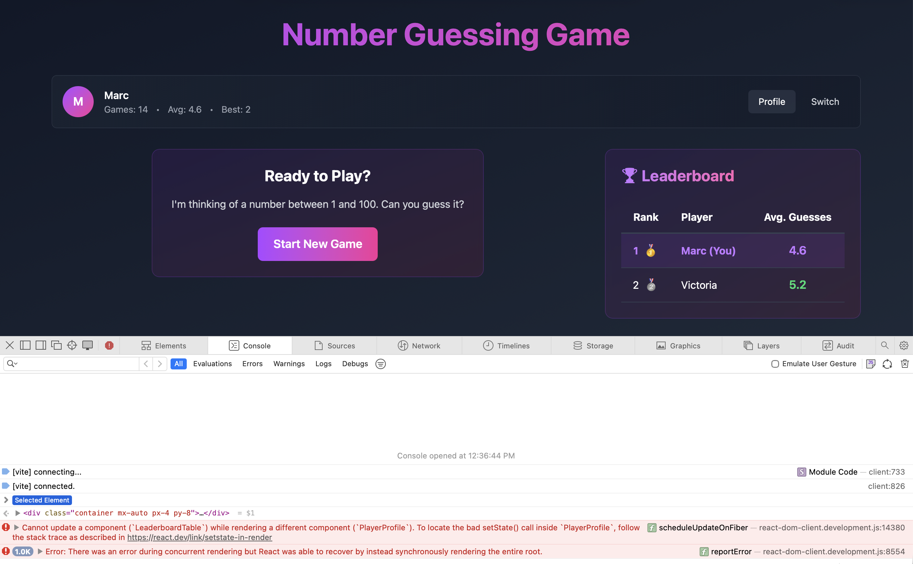

# Number Guess

[](https://github.com/sapientpants/number-guess/actions/workflows/ci.yml)
[](https://github.com/sapientpants/number-guess/actions/workflows/codeql.yml)

A colorful number guessing game: find the number between 1 and 100 in as few guesses as
possible. Hot/cold feedback tells you how close you are, every player gets their own stats, and
a leaderboard ranks everyone by average guesses.



## Features

- Hot / warm / cold feedback with color gradients and temperature emoji
- Multiple local players with per-player statistics (games played, win rate, best game, average)
- Leaderboard of the top 10 players by average guesses
- Game insights: streaks, perfect games, recent results
- Everything is stored in the browser's `localStorage` — no account or server needed

## Quick start

Requirements: Node.js 24 and pnpm (version pinned in `package.json`). With
[mise](https://mise.jdx.dev/) installed, `mise install` sets both up.

```sh
pnpm install
pnpm dev        # http://localhost:5173
```

## Scripts

| Command              | What it does                                                    |
| -------------------- | --------------------------------------------------------------- |
| `pnpm dev`           | Start the Vite dev server                                       |
| `pnpm build`         | Type-check and build for production into `dist/`                |
| `pnpm preview`       | Serve the production build                                      |
| `pnpm test`          | Run tests in watch mode                                         |
| `pnpm test:coverage` | Run tests once with coverage (fails below 90%)                  |
| `pnpm mutation-test` | Mutation testing with Stryker (slow; runs weekly in CI)         |
| `pnpm lint`          | ESLint (TypeScript, React, a11y, JSON, Markdown)                |
| `pnpm lint:spelling` | Spell-check with cspell                                         |
| `pnpm format`        | Format everything with Prettier                                 |
| `pnpm quality`       | Dead code (knip), duplication (jscpd), circular imports (madge) |
| `pnpm size`          | Check bundle size budgets (run after `pnpm build`)              |
| `pnpm ci`            | The full quality gate — the same checks CI runs                 |

## Architecture

React 19 + TypeScript, built with Vite, styled with Tailwind CSS v4, animated with Framer Motion.

```text
src/
├── components/   Game, Player, Leaderboard and shared UI components
├── hooks/        Reusable React hooks
├── store/        Zustand stores: players, current game, leaderboard
├── utils/        Pure logic: guess feedback, insights, persistence, ids
└── types/        Shared TypeScript types
```

- **State** lives in three [Zustand](https://zustand.docs.pmnd.rs/) stores. The player store is
  the source of truth for stats; the leaderboard store is derived from it.
- **Persistence** goes exclusively through `src/utils/storage.ts`, which validates every record
  it loads from `localStorage` and never throws if storage is full or unavailable.
- **Game logic** in `src/utils/` is framework-free and covered by unit, property-based and
  mutation tests.

Key decisions are recorded as [Architecture Decision Records](docs/adr/).

## Quality gates

Every commit runs `pnpm ci` through a Husky pre-commit hook, and commit messages must follow
[Conventional Commits](https://www.conventionalcommits.org/). CI additionally runs actionlint,
OSV-Scanner and CodeQL. See [CONTRIBUTING.md](CONTRIBUTING.md) for the full workflow.

## License

ISC
